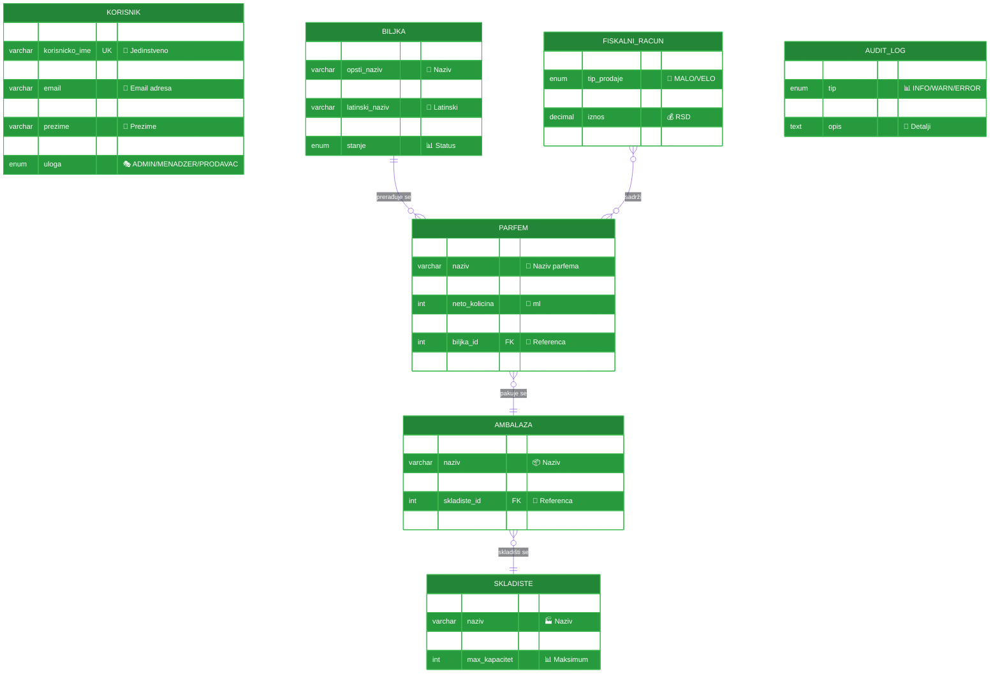
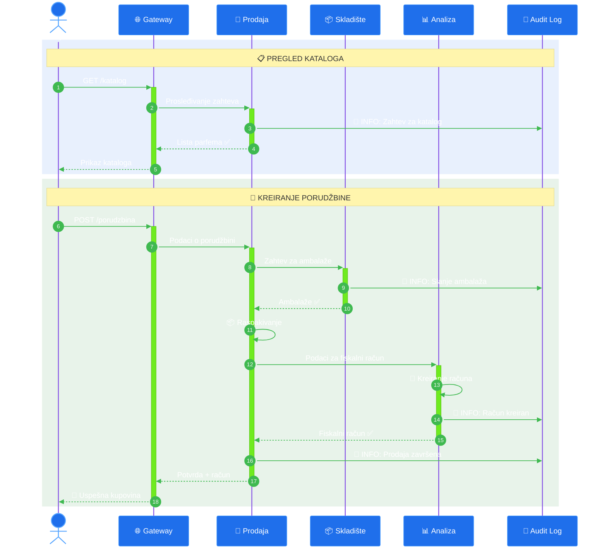

```mermaid
%%{init: {'theme': 'base', 'themeVariables': { 'primaryColor': '#1f6feb', 'primaryTextColor': '#ffffff', 'primaryBorderColor': '#58a6ff', 'lineColor': '#8957e5', 'secondaryColor': '#238636', 'tertiaryColor': '#161b22', 'background': '#0d1117', 'mainBkg': '#161b22', 'nodeBorder': '#30363d'}}}%%

flowchart TB
    subgraph CLIENT["<b>🖥️ KLIJENT</b>"]
        direction TB
        E["<b>Electron</b><br/>Desktop Aplikacija"]
    end

    subgraph GATEWAY["<b>🌐 API GATEWAY</b>"]
        direction TB
        G["<b>Rutiranje</b><br/>Autentifikacija & Autorizacija"]
    end

    subgraph SERVICES["<b>⚙️ MIKROSERVISI</b>"]
        direction TB
        
        subgraph AUTH["🔐 Autentifikacija"]
            A1["Prijava / Registracija"]
        end
        
        subgraph USER["👤 Korisnici"]
            U1["CRUD Operacije"]
        end
        
        subgraph PROD["🌱 Proizvodnja"]
            P1["Sađenje / Branje"]
        end
        
        subgraph PROC["⚗️ Prerada"]
            PR1["Kreiranje Parfema"]
        end
        
        subgraph STOR["📦 Skladištenje"]
            S1["Pakovanje / Slanje"]
        end
        
        subgraph SALE["🛒 Prodaja"]
            SA1["Katalog / Porudžbine"]
        end
        
        subgraph ANAL["📊 Analiza"]
            AN1["Izveštaji / Statistika"]
        end
        
        subgraph PERF["⚡ Performanse"]
            PE1["Simulacija / Optimizacija"]
        end
        
        subgraph AUDIT["📝 Evidencija"]
            AU1["Logovanje Događaja"]
        end
    end

    subgraph DATABASE["<b>🗄️ MySQL BAZE PODATAKA</b>"]
        direction LR
        DB1[("korisnici")]
        DB2[("proizvodnja")]
        DB3[("prerada")]
        DB4[("skladista")]
        DB5[("prodaja")]
        DB6[("izvestaji_analize")]
        DB7[("izvestaji_performanse")]
        DB8[("audit_logovi")]
    end

    E <===> G
    G <---> AUTH & USER & PROD & PROC & STOR & SALE & ANAL & PERF & AUDIT

    AUTH & USER --> DB1
    PROD --> DB2
    PROC --> DB3
    STOR --> DB4
    SALE --> DB5
    ANAL --> DB6
    PERF --> DB7
    AUDIT --> DB8

    style CLIENT fill:#238636,stroke:#3fb950,stroke-width:3px,color:#ffffff
    style GATEWAY fill:#1f6feb,stroke:#58a6ff,stroke-width:3px,color:#ffffff
    style SERVICES fill:#161b22,stroke:#8957e5,stroke-width:2px
    style DATABASE fill:#0d1117,stroke:#f78166,stroke-width:2px
```

<div align="center">

<!-- Animirani Header sa Gradijentom -->


<!-- Typing Animacija -->
<a href="#">
  
</a>

<br/>

<!-- Animirana Linija -->


<br/>

<!-- Tech Stack Badges sa Bojama -->
<p>
  
  
  
  
</p>

<!-- Dodatni Badges -->
<p>
  
  
  
  
  
</p>


</div>

<br/>

<!-- ═══════════════════════════════════════════════════════════════════════════════ -->
##  &nbsp;O Projektu
<!-- ═══════════════════════════════════════════════════════════════════════════════ -->


Kompletan **informacioni sistem** implementiran kroz mikroservisnu arhitekturu sa posebnim fokusom na **bezbednosne aspekte**.

<br/>

### ✨ Ključne Karakteristike

- 🏗️ **9 nezavisnih mikroservisa**
- 🌐 **Centralizovani API Gateway**
- 🖥️ **Desktop klijentska aplikacija**
- 🔐 **JWT autentifikacija**
- 🛡️ **RBAC kontrola pristupa**
- 📝 **Kompletan audit trail**

<br clear="right"/>

<br/>

<!-- ═══════════════════════════════════════════════════════════════════════════════ -->
##  &nbsp;Članovi Tima
<!-- ═══════════════════════════════════════════════════════════════════════════════ -->

<table>
<tr>
<td>

| &nbsp;&nbsp;&nbsp;🎓&nbsp;&nbsp;&nbsp; | Indeks | Ime i Prezime |
|:---:|:---|:---|
| 👩‍💻 | `PR 62/2022` | **Lazić Katarina** |
| 👨‍💻 | `PR 55/2022` | **Simić Slaviša** |
| 👩‍💻 | `PR 36/2022` | **Misić Jovana** |
| 👩‍💻 | `PR 42/2022` | **Stojković Andrijana** |
| 👩‍💻 | `PR 7/2022` | **Vasić Nikolina** |
| 👩‍💻 | `PR 11/2022` | **Ćurčić Milica** |

</td>
<td>


</td>
</tr>
</table>

<br/>

<!-- ═══════════════════════════════════════════════════════════════════════════════ -->
##  &nbsp;Arhitektura Sistema
<!-- ═══════════════════════════════════════════════════════════════════════════════ -->

<div align="center">
<br/>



<br/>
</div>

<br/>

<!-- ═══════════════════════════════════════════════════════════════════════════════ -->
##  &nbsp;Bezbednosne Karakteristike
<!-- ═══════════════════════════════════════════════════════════════════════════════ -->

<table>
<tr>
<td width="50%">

### 🔑 Autentifikacija
```
┌────────────────────────────────────┐
│  ✅ JWT Tokeni                     │
│  ✅ Refresh Token mehanizam        │
│  ✅ Sesije sa vremenskim limitom   │
│  ✅ Validacija na svakom zahtevu   │
└────────────────────────────────────┘
```

### 🔒 Zaštita Podataka
```
┌────────────────────────────────────┐
│  ✅ Bcrypt heširanje lozinki       │
│  ✅ Saltovanje                     │
│  ✅ Enkripcija osetljivih polja    │
│  ✅ SQL injection prevencija       │
└────────────────────────────────────┘
```

</td>
<td width="50%">

### 🛡️ Mrežna Bezbednost
```
┌────────────────────────────────────┐
│  ✅ CORS konfiguracija             │
│  ✅ Rate limiting                  │
│  ✅ Request validacija             │
│  ✅ Sanitizacija inputa            │
└────────────────────────────────────┘
```

### 📋 Revizija i Praćenje
```
┌────────────────────────────────────┐
│  ✅ Kompletan audit trail          │
│  ✅ INFO / WARNING / ERROR logovi  │
│  ✅ Praćenje svih akcija           │
│  ✅ Vremenske oznake               │
└────────────────────────────────────┘
```

</td>
</tr>
</table>

<br/>

<!-- ═══════════════════════════════════════════════════════════════════════════════ -->
##  &nbsp;Korisničke Uloge
<!-- ═══════════════════════════════════════════════════════════════════════════════ -->

<table>
<tr>
<td align="center" width="33%">

### 🛡️ Administrator


```
╔═══════════════════════════╗
║  📊 Analiza performansi   ║
║  📝 Evidencija događaja   ║
║  📈 Analiza podataka      ║
║  ⚙️  Upravljanje sistemom  ║
╚═══════════════════════════╝
```

**Pristup servisima:**
- ⚡ Analiza Performansi
- 📝 Evidencija Događaja  
- 📊 Analiza Podataka

</td>
<td align="center" width="33%">

### 📊 Menadžer Prodaje


```
╔═══════════════════════════╗
║  🏭 Distributivni centar  ║
║  📦 3 ambalaže / slanje   ║
║  ⏱️  0.5s vreme obrade     ║
║  🧾 Svi fiskalni računi   ║
╚═══════════════════════════╝
```

**Pristup servisima:**
- 🌱 Proizvodnja
- ⚗️ Prerada
- 📦 Skladištenje
- 🛒 Prodaja

</td>
<td align="center" width="33%">

### 🛒 Prodavac


```
╔═══════════════════════════╗
║  🏪 Magacinski centar     ║
║  📦 1 ambalaža / slanje   ║
║  ⏱️  2.5s vreme obrade     ║
║  🧾 Kreiranje računa      ║
╚═══════════════════════════╝
```

**Pristup servisima:**
- 🌱 Proizvodnja
- ⚗️ Prerada
- 📦 Skladištenje
- 🛒 Prodaja

</td>
</tr>
</table>

<br/>

<!-- ═══════════════════════════════════════════════════════════════════════════════ -->
##  &nbsp;Pregled Mikroservisa
<!-- ═══════════════════════════════════════════════════════════════════════════════ -->

<details>
<summary>

&nbsp;<b>Klikni za detalje</b>
</summary>

<br/>

| Komponenta | Opis |
|:---|:---|
| 📁 **Baza podataka** | `korisnici` |
| 🔧 **Funkcionalnosti** | Registracija, Prijava, JWT generisanje |
| ✅ **Validacije** | Email format, jačina lozinke, jedinstvenost korisničkog imena |

```javascript
// Primer JWT payload-a
{
  "userId": 1,
  "username": "korisnik",
  "role": "PRODAVAC",
  "iat": 1699999999,
  "exp": 1700001799
}
```

</details>

<details>
<summary>

&nbsp;<b>Klikni za detalje</b>
</summary>

<br/>

| Komponenta | Opis |
|:---|:---|
| 📁 **Baza podataka** | `korisnici` |
| 🔧 **Funkcionalnosti** | Dodavanje, Ažuriranje, Brisanje, Pretraga |
| 📋 **Atributi korisnika** | ID, Korisničko ime, Email, Ime, Prezime, Profilna slika (base64), Uloga |

</details>

<details>
<summary>

&nbsp;<b>Klikni za detalje</b>
</summary>

<br/>

| Komponenta | Opis |
|:---|:---|
| 📁 **Baza podataka** | `proizvodnja` |
| 🔧 **Funkcionalnosti** | Sađenje biljaka, Promena jačine ulja, Branje |

**Atributi biljke:**
| Atribut | Tip | Opis |
|:---|:---|:---|
| `opsti_naziv` | string | Naziv biljke |
| `jacina_ulja` | float | Vrednost 1.0 - 5.0 |
| `latinski_naziv` | string | Latinski naziv |
| `zemlja_porekla` | string | Država porekla |
| `stanje` | enum | POSAĐENA / UBRANA / PRERAĐENA |

</details>

<details>
<summary>

&nbsp;<b>Klikni za detalje</b>
</summary>

<br/>

| Komponenta | Opis |
|:---|:---|
| 📁 **Baza podataka** | `prerada` |
| 🔧 **Funkcionalnosti** | Prerada biljaka u parfeme, Balansiranje jačine ulja |
| 📐 **Formula** | 1 biljka = 50ml parfema |
| 🏷️ **Serijski broj** | `PP-2025-{ID_PARFEMA}` |

**Atributi parfema:**
| Atribut | Tip | Opis |
|:---|:---|:---|
| `naziv` | string | Naziv parfema |
| `tip` | enum | PARFEM / KOLONJSKA_VODA |
| `neto_kolicina` | int | 150ml ili 250ml |
| `rok_trajanja` | date | Datum isteka |

> ⚠️ **Napomena:** Ako jačina ulja prelazi 4.0, sistem automatski sadi novu biljku i balansira vrednosti.

</details>

<details>
<summary>

&nbsp;<b>Klikni za detalje</b>
</summary>

<br/>

| Komponenta | Opis |
|:---|:---|
| 📁 **Baza podataka** | `skladista` |
| 🔧 **Funkcionalnosti** | Pakovanje parfema, Slanje ambalaža, Upravljanje kapacitetom |

**Tipovi skladišta:**

| Tip | Korisnik | Kapacitet | Vreme |
|:---|:---|:---:|:---:|
| 🏭 **Distributivni centar** | Menadžer | 3 ambalaže | 0.5s |
| 🏪 **Magacinski centar** | Prodavac | 1 ambalaža | 2.5s |

</details>

<details>
<summary>

&nbsp;<b>Klikni za detalje</b>
</summary>

<br/>

| Komponenta | Opis |
|:---|:---|
| 📁 **Baza podataka** | `prodaja` |
| 🔧 **Funkcionalnosti** | Katalog proizvoda, Poručivanje, Raspakivanje ambalaža |

**Fiskalni račun sadrži:**
- 📋 Tip prodaje (MALOPRODAJA / VELEPRODAJA)
- 💳 Način plaćanja (GOTOVINA / KARTICA / UPLATA)
- 🧴 Lista parfema sa količinama
- 💰 Ukupan iznos

</details>

<details>
<summary>

&nbsp;<b>Klikni za detalje</b>
</summary>

<br/>

| Komponenta | Opis |
|:---|:---|
| 📁 **Baza podataka** | `izvestaji_analize` |
| 🔧 **Funkcionalnosti** | Kreiranje izveštaja, Analiza prodaje, PDF izvoz |

**Dostupne analize:**
- 📅 Prodaja po mesecu / nedelji / godini
- 📈 Trend analiza
- 🏆 Top 10 najprodavanijih parfema
- 💰 Ukupan prihod po kategorijama

</details>

<details>
<summary>

&nbsp;<b>Klikni za detalje</b>
</summary>

<br/>

| Komponenta | Opis |
|:---|:---|
| 📁 **Baza podataka** | `izvestaji_performanse` |
| 🔧 **Funkcionalnosti** | Simulacija algoritama, Poređenje efikasnosti, Optimizacija |

**Metrike:**
- ⏱️ Vreme obrade
- 📊 Propusnost sistema
- 🎯 Efikasnost algoritama
- 💡 Preporuke za poboljšanje

</details>

<details>
<summary>

&nbsp;<b>Klikni za detalje</b>
</summary>

<br/>

| Komponenta | Opis |
|:---|:---|
| 📁 **Baza podataka** | `audit_logovi` |
| 🔧 **Funkcionalnosti** | Logovanje svih akcija, Pretraga, Filtriranje |

**Tipovi zapisa:**

| Tip | Boja | Opis |
|:---|:---:|:---|
| `INFO` | 🟢 | Standardne operacije |
| `WARNING` | 🟡 | Upozorenja i anomalije |
| `ERROR` | 🔴 | Greške u sistemu |

</details>

<br/>

<!-- ═══════════════════════════════════════════════════════════════════════════════ -->
##  &nbsp;Dijagram Entiteta
<!-- ═══════════════════════════════════════════════════════════════════════════════ -->

<div align="center">



</div>

<br/>

<!-- ═══════════════════════════════════════════════════════════════════════════════ -->
##  &nbsp;Tok Podataka - Proces Prodaje
<!-- ═══════════════════════════════════════════════════════════════════════════════ -->

<div align="center">



</div>

<br/>

<!-- ═══════════════════════════════════════════════════════════════════════════════ -->
##  &nbsp;Struktura Projekta
<!-- ═══════════════════════════════════════════════════════════════════════════════ -->

```
📦 oib-projekat/
│
├── 🖥️ klijent/                              # Electron Desktop Aplikacija
│   ├── 📂 src/
│   │   ├── 📂 komponente/                   # Vue/React komponente
│   │   │   ├── 📄 Navbar.vue
│   │   │   ├── 📄 Sidebar.vue
│   │   │   └── 📄 ...
│   │   ├── 📂 stranice/                     # Prikazi stranica
│   │   │   ├── 📄 Prijava.vue
│   │   │   ├── 📄 Proizvodnja.vue
│   │   │   ├── 📄 Prerada.vue
│   │   │   └── 📄 ...
│   │   ├── 📂 servisi/                      # API servisi
│   │   │   ├── 📄 AuthServis.js
│   │   │   ├── 📄 KorisnikServis.js
│   │   │   └── 📄 ...
│   │   └── 📂 pomocnici/                    # Utility funkcije
│   ├── 📄 main.js                           # Electron main process
│   ├── 📄 preload.js                        # Preload script
│   └── 📄 package.json
│
├── ⚙️ servisi/
│   ├── 📂 gateway/                          # 🌐 API Gateway
│   │   ├── 📂 src/
│   │   │   ├── 📂 middleware/
│   │   │   │   ├── 📄 auth.middleware.js
│   │   │   │   └── 📄 cors.middleware.js
│   │   │   ├── 📂 routes/
│   │   │   └── 📄 index.js
│   │   └── 📄 package.json
│   │
│   ├── 📂 autentifikacija/                  # 🔐 Auth Servis
│   │   ├── 📂 src/
│   │   │   ├── 📂 controllers/
│   │   │   ├── 📂 services/
│   │   │   └── 📂 entities/
│   │   └── 📄 package.json
│   │
│   ├── 📂 korisnici/                        # 👤 User Servis
│   ├── 📂 proizvodnja/                      # 🌱 Production Servis
│   ├── 📂 prerada/                          # ⚗️ Processing Servis
│   ├── 📂 skladistenje/                     # 📦 Storage Servis
│   ├── 📂 prodaja/                          # 🛒 Sales Servis
│   ├── 📂 analiza-podataka/                 # 📊 Analytics Servis
│   ├── 📂 analiza-performansi/              # ⚡ Performance Servis
│   └── 📂 evidencija/                       # 📝 Audit Servis
│
├── 📂 deljeno/                              # Zajednički kod
│   ├── 📂 entiteti/                         # TypeORM entiteti
│   ├── 📂 interfejsi/                       # TypeScript interfejsi
│   ├── 📂 dto/                              # Data Transfer Objects
│   └── 📂 konstante/                        # Konstante i enumi
│
├── 📂 baza/
│   └── 📄 init.sql                          # Inicijalni podaci
│
├── 🐳 docker-compose.yml                    # Docker konfiguracija
├── ⚙️ .env.example                          # Primer env fajla
├── 📖 README.md                             # Dokumentacija
└── 📄 package.json                          # Root package.json
```

<br/>

<!-- ═══════════════════════════════════════════════════════════════════════════════ -->
##  &nbsp;Konfiguracija
<!-- ═══════════════════════════════════════════════════════════════════════════════ -->

<table>
<tr>
<td>

### 🗄️ Baza Podataka
```env
DB_HOST=localhost
DB_PORT=3306
DB_USERNAME=root
DB_PASSWORD=your_password
DB_NAME=oib_projekat
```

</td>
<td>

### 🔐 JWT Konfiguracija
```env
JWT_SECRET=super_tajna_vrednost
JWT_EXPIRATION=30m
JWT_REFRESH_EXPIRATION=7d
```

</td>
</tr>
<tr>
<td>

### 🌐 Gateway
```env
GATEWAY_PORT=3000
GATEWAY_HOST=localhost
```

</td>
<td>

### 🛡️ CORS
```env
ALLOWED_ORIGINS=http://localhost:3000
ALLOWED_METHODS=GET,POST,PUT,DELETE
ALLOWED_HEADERS=Content-Type,Authorization
```

</td>
</tr>
</table>

**URL adrese mikroservisa:**
```env
AUTH_SERVICE_URL=http://localhost:3001
USER_SERVICE_URL=http://localhost:3002
PRODUCTION_SERVICE_URL=http://localhost:3003
PROCESSING_SERVICE_URL=http://localhost:3004
STORAGE_SERVICE_URL=http://localhost:3005
SALES_SERVICE_URL=http://localhost:3006
ANALYTICS_SERVICE_URL=http://localhost:3007
PERFORMANCE_SERVICE_URL=http://localhost:3008
AUDIT_SERVICE_URL=http://localhost:3009
```

<br/>

<!-- ═══════════════════════════════════════════════════════════════════════════════ -->
##  &nbsp;Pokretanje Projekta
<!-- ═══════════════════════════════════════════════════════════════════════════════ -->

```bash
# 📥 1. Kloniranje repozitorijuma
git clone https://github.com/username/oib-projekat.git
cd oib-projekat

# 📦 2. Instalacija zavisnosti
npm install

# ⚙️ 3. Konfiguracija environment varijabli
cp .env.example .env
# Urediti .env fajl sa odgovarajućim vrednostima

# 🐳 4. Pokretanje MySQL baze (Docker)
docker-compose up -d mysql

# ⏳ 5. Sačekati da se baza pokrene, zatim pokrenuti migracije
npm run migration:run

# 🚀 6. Pokretanje svih mikroservisa
npm run start:services

# 🖥️ 7. Pokretanje Electron klijenta
npm run start:client
```

<br/>

<!-- ═══════════════════════════════════════════════════════════════════════════════ -->
##  &nbsp;Tehničke Napomene
<!-- ═══════════════════════════════════════════════════════════════════════════════ -->

| # | 📋 Napomena | ✅ Status |
|:---:|:---|:---:|
| 1 | Klijentska aplikacija koristi **Electron** sa **Vite.js** | ✅ |
| 2 | Samo **Gateway** je javno dostupan klijentskoj aplikaciji | ✅ |
| 3 | Svaki mikroservis ima **sopstvenu bazu** podataka | ✅ |
| 4 | Obavezna primena **SOLID** principa i čiste arhitekture | ✅ |
| 5 | Sve lozinke se **heširaju** pre čuvanja u bazi | ✅ |
| 6 | Rad sa bazom koristi **TypeORM** | ✅ |
| 7 | Klijentska aplikacija koristi **injektovane servise** | ✅ |
| 8 | Sve rute su **zaštićene** od neovlašćenog pristupa | ✅ |
| 9 | Baza podataka: **MySQL** | ✅ |
| 10 | Konfiguracija se čuva u **.env** fajlovima | ✅ |
| 11 | **CORS** mora biti precizno podešen za svaki servis | ✅ |
| 12 | Projekat mora imati **inicijalne testne podatke** | ✅ |

<br/>

<!-- ═══════════════════════════════════════════════════════════════════════════════ -->
##  &nbsp;Statistika Projekta
<!-- ═══════════════════════════════════════════════════════════════════════════════ -->

<div align="center">

<table>
<tr>
<td align="center">

</td>
<td align="center">

</td>
<td align="center">

</td>
<td align="center">

</td>
</tr>
</table>

<br/>

```
╔══════════════════════════════════════════════════════════════════════════════════╗
║                                                                                  ║
║   🔐 AUTENTIFIKACIJA    →    🌐 GATEWAY    →    ⚙️ MIKROSERVISI    →    🗄️ BAZE   ║
║                                                                                  ║
║        JWT Tokeni              Rutiranje           SOLID Principi        MySQL   ║
║        Heširanje               CORS                TypeORM               8 baza  ║
║        Sesije                  Auth Check          Clean Architecture            ║
║                                                                                  ║
╚══════════════════════════════════════════════════════════════════════════════════╝
```

</div>

<br/>

---

<div align="center">


<br/>

<!-- Footer -->


<br/>


</div>