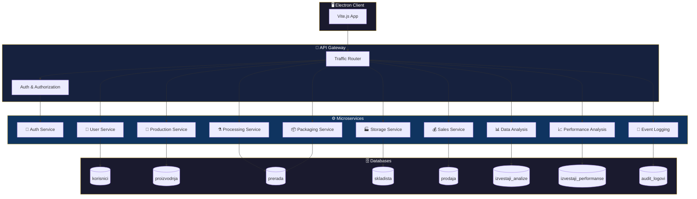

<div align="center">

<!-- Animated Header -->


<!-- Animated Logo -->


<br/>

<!-- Badges Row 1 -->
[](https://www.typescriptlang.org/)
[](https://www.electronjs.org/)
[](https://vitejs.dev/)
[](https://nestjs.com/)

<!-- Badges Row 2 -->
[](https://www.mysql.com/)
[](https://typeorm.io/)
[](https://www.docker.com/)

<br/>

<!-- Stats Badges -->


<br/>

<!-- Decorative Divider -->


</div>

## 🌹 О Пројекту | About


**O'Signel De Or** је софистицирани информациони систем за управљање познатом париском парфимеријом. Систем је изграђен на модерној микросервисној архитектури која обезбеђује скалабилност, сигурност и висок ниво перформанси.

> *"Perfume is the art that makes memory speak."* — Kenzo Takada

### ✨ Кључне карактеристике

- 🔐 **Сигурна аутентификација** — JWT токени са хеширањем лозинки
- 🏭 **Микросервисна архитектура** — 9 независних сервиса
- 📊 **Напредна аналитика** — Извештаји о продаји и перформансама
- 🎨 **Модеран UI** — Electron + Vite.js клијентска апликација
- 📝 **Евиденција догађаја** — Комплетан audit log систем

<br clear="right"/>

---

## 🏛️ Архитектура система

<div align="center">



</div>

---

## 🎭 Улоге корисника

<div align="center">

| Улога | Приступ | Опис |
|:---:|:---|:---|
| 🔴 **Администратор** | Аналитика, Евиденција, Перформансе | Комплетан увид у системске извештаје |
| 🟡 **Менаџер продаје** | Дистрибутивни центар (3 амбалаже/0.5s) | Велепродајне операције |
| 🟢 **Продавац** | Магацински центар (1 амбалажа/2.5s) | Малопродајне операције |

</div>

---

## 📦 Ентитети

<details>
<summary>🌿 <b>Биљка (Plant)</b></summary>
<br/>

```typescript
interface Biljka {
  id: number;
  opstiNaziv: string;           // Општи назив
  jacinaAromaticnihUlja: number; // 1.0 - 5.0
  latinskiNaziv: string;        // Латински назив
  zemljaPorekla: string;        // Земља порекла
  stanje: 'POSADJANA' | 'UBRANA' | 'PRERADJENA';
}
```
</details>

<details>
<summary>🧴 <b>Парфем (Perfume)</b></summary>
<br/>

```typescript
interface Parfem {
  id: number;
  naziv: string;
  tip: 'PARFEM' | 'KOLONJSKA_VODA';
  netoKolicina: 150 | 250;       // ml
  serijskiBroj: string;          // PP-2025-{ID}
  biljkaId: number;
  rokTrajanja: Date;
}
```
</details>

<details>
<summary>📦 <b>Амбалажа (Packaging)</b></summary>
<br/>

```typescript
interface Ambalaza {
  id: number;
  naziv: string;
  adresaPosiljaoca: string;
  skladisteId: number;
  parfemiIds: number[];
  status: 'SPAKOVANA' | 'POSLATA';
}
```
</details>

<details>
<summary>🏭 <b>Складиште (Warehouse)</b></summary>
<br/>

```typescript
interface Skladiste {
  id: number;
  naziv: string;
  lokacija: string;
  maksimalanBrojAmbalaza: number;
}
```
</details>

<details>
<summary>🧾 <b>Фискални рачун (Invoice)</b></summary>
<br/>

```typescript
interface FiskalniRacun {
  id: number;
  tipProdaje: 'MALOPRODAJA' | 'VELEPRODAJA';
  nacinPlacanja: 'GOTOVINA' | 'UPLATA_NA_RACUN' | 'KARTICNO';
  stavke: { parfemId: number; kolicina: number }[];
  ukupanIznos: number;
}
```
</details>

---

## 🚀 Инсталација

<div align="center">

</div>

### Предуслови

```bash
# Проверите верзије
node --version  # >= 18.0.0
npm --version   # >= 9.0.0
mysql --version # >= 8.0
```

### 1️⃣ Клонирање репозиторијума

```bash
git clone https://github.com/your-username/osignel-de-or.git
cd osignel-de-or
```

### 2️⃣ Подешавање окружења

```bash
# Копирајте .env.example у .env за сваки микросервис
cp services/auth-service/.env.example services/auth-service/.env
cp services/user-service/.env.example services/user-service/.env
# ... понављајте за остале сервисе
```

### 3️⃣ Инсталација зависности

```bash
# Инсталација за све сервисе
npm run install:all

# Или појединачно
cd services/auth-service && npm install
cd ../user-service && npm install
# ...
```

### 4️⃣ Покретање база података

```bash
# Са Docker-ом
docker-compose up -d mysql

# Или локално креирајте базе
mysql -u root -p < scripts/create-databases.sql
```

### 5️⃣ Покретање микросервиса

```bash
# Покрените све сервисе
npm run start:all

# Или појединачно (у различитим терминалима)
npm run start:gateway     # Port 3000
npm run start:auth        # Port 3001
npm run start:users       # Port 3002
npm run start:production  # Port 3003
npm run start:processing  # Port 3004
npm run start:packaging   # Port 3005
npm run start:storage     # Port 3006
npm run start:sales       # Port 3007
npm run start:analytics   # Port 3008
npm run start:performance # Port 3009
npm run start:audit       # Port 3010
```

### 6️⃣ Покретање клијентске апликације

```bash
cd client
npm install
npm run dev
```

---

## 🖼️ Снимци екрана

<div align="center">

### 🔐 Аутентификација


<br/><br/>

### 🌱 Производња


<br/><br/>

### 📊 Аналитика продаје


</div>

---

## 📁 Структура пројекта

```
osignel-de-or/
├── 📂 client/                    # Electron + Vite.js клијент
│   ├── 📂 src/
│   │   ├── 📂 components/        # UI компоненте
│   │   ├── 📂 services/          # Инјектовани сервиси
│   │   ├── 📂 pages/             # Странице апликације
│   │   └── 📂 guards/            # Route guards
│   └── 📄 electron.js
│
├── 📂 services/                  # Микросервиси
│   ├── 📂 gateway/               # API Gateway (Port 3000)
│   ├── 📂 auth-service/          # Аутентификација (Port 3001)
│   ├── 📂 user-service/          # Корисници (Port 3002)
│   ├── 📂 production-service/    # Производња (Port 3003)
│   ├── 📂 processing-service/    # Прерада (Port 3004)
│   ├── 📂 packaging-service/     # Паковање (Port 3005)
│   ├── 📂 storage-service/       # Складиштење (Port 3006)
│   ├── 📂 sales-service/         # Продаја (Port 3007)
│   ├── 📂 analytics-service/     # Анализа података (Port 3008)
│   ├── 📂 performance-service/   # Анализа перформанси (Port 3009)
│   └── 📂 audit-service/         # Евиденција догађаја (Port 3010)
│
├── 📂 shared/                    # Дељени модули
│   ├── 📂 entities/              # TypeORM ентитети
│   ├── 📂 interfaces/            # TypeScript интерфејси
│   └── 📂 utils/                 # Помоћне функције

```

---

## 🔒 Безбедност

<div align="center">

| Мера | Имплементација |
|:---:|:---|
| 🔑 | Хеширање лозинки (bcrypt) |
| 🎫 | JWT токени за аутентификацију |
| 🛡️ | CORS подешавања по микросервису |
| 🚫 | Gateway-only приступ микросервисима |
| 📝 | Комплетна евиденција догађаја |
| ⏱️ | Сесија истиче након 30 минута |

</div>

---

## 🧪 SOLID Принципи

<div align="center">

| Принцип | Примена у пројекту |
|:---:|:---|
| **S**ingle Responsibility | Сваки микросервис има једну одговорност |
| **O**pen/Closed | Сервиси прошириви преко интерфејса |
| **L**iskov Substitution | Дистрибутивни/Магацински центар |
| **I**nterface Segregation | Специфични интерфејси по сервису |
| **D**ependency Inversion | Инјектоване зависности свуда |

</div>

---

## 📈 Перформансе

```
┌─────────────────────────────────────────────────────────────┐
│                  ДИСТРИБУТИВНИ ЦЕНТАР                       │
│  ═══════════════════════════════════════════════════════   │
│  📦 Амбалаже по слању: 3                                   │
│  ⏱️  Време обраде: 0.5s                                     │
│  🚀 Брзина: 6.0 амб/с                                       │
│  ✅ Ефикасност: 93%                                         │
│  💼 Оптимално за: Велепродаја, велики обим                 │
└─────────────────────────────────────────────────────────────┘

┌─────────────────────────────────────────────────────────────┐
│                   МАГАЦИНСКИ ЦЕНТАР                         │
│  ═══════════════════════════════════════════════════════   │
│  📦 Амбалаже по слању: 1                                   │
│  ⏱️  Време обраде: 2.5s                                     │
│  🚀 Брзина: 0.4 амб/с                                       │
│  ✅ Ефикасност: 35%                                         │
│  💼 Оптимално за: Малопродаја, појединачне                 │
└─────────────────────────────────────────────────────────────┘
```

---

## 🤝 Допринос пројекту

<div align="center">

</div>

```bash
# 1. Fork репозиторијум
# 2. Креирајте feature branch
git checkout -b feature/amazing-feature

# 3. Commit промене
git commit -m '✨ Add amazing feature'

# 4. Push на branch
git push origin feature/amazing-feature

# 5. Отворите Pull Request
```

---

## 📜 Лиценца

<div align="center">

Овај пројекат је лиценциран под **MIT** лиценцом.

[Погледајте LICENSE](./LICENSE)

</div>

---

## 📞 Контакт

<div align="center">

[](mailto:your-email@example.com)
[](https://linkedin.com/in/your-profile)
[](https://your-portfolio.com)

</div>

---

<div align="center">

<!-- Animated Footer -->


<br/>

**TEST**

<br/>


</div>